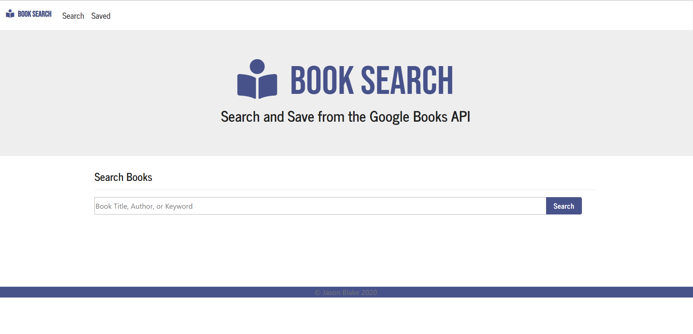

# Google My Books

Overview
A React-based Google Books Search that displays books on user searches. Search for books using the Google Books API by typing in a title and clicking on "Search". The user can view the book which will bring them to the page on Google Books by clicking "View" in the results for the search. Click "Save" to save the book to the database.

How to Install
- Clone the repository
- Run npm install
- Cd into the client folder
- Run npm install again
- Activate a MongoDB Database.
- Run npm start and the application will automatically open in the browser to localhost:3000.

Technologies Used
- Node.js
- Express.js
- MongoDB
- Mongoose
- React.js
- Bootstrap

